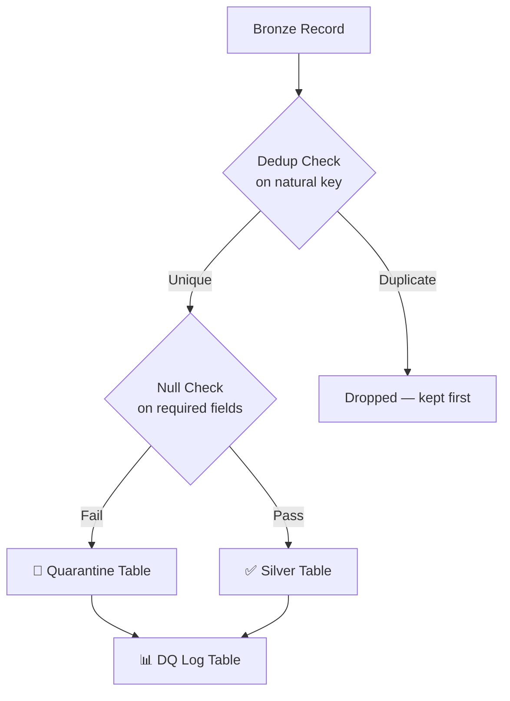

# Olist E-Commerce Data Pipeline

A production-style **Medallion Architecture** data pipeline built with **PySpark** and **Delta Lake** on **Databricks**, using the [Brazilian E-Commerce Public Dataset by Olist](https://www.kaggle.com/datasets/olistbr/brazilian-ecommerce).

---

## Architecture

```mermaid
flowchart LR
    subgraph Sources["📦 Source (Kaggle CSVs)"]
        CSV1[orders]
        CSV2[order_items]
        CSV3[customers]
        CSV4[products]
        CSV5[sellers]
        CSV6[payments]
        CSV7[reviews]
        CSV8[geolocation]
        CSV9[category_translation]
    end

    subgraph Bronze["🥉 Bronze Layer"]
        direction TB
        B1[olist_bronze.*]
        B_META["+ _ingestion_timestamp\n+ _source_file\n+ _batch_id\n+ _ingestion_date"]
    end

    subgraph Silver["🥈 Silver Layer"]
        direction TB
        S1[orders — typed, deduped]
        S2[customers — + geolocation]
        S3[products — + english names]
        S4[sellers — + geolocation]
        S5[order_items — typed]
        S6[order_payments — typed]
        S7[order_reviews — typed]
        S_DQ["🛡️ DQ: quarantine + dq_log"]
    end

    subgraph Gold["🥇 Gold Layer"]
        direction TB
        G1[daily_sales_summary]
        G2[customer_ltv]
        G3[seller_performance]
        G4[order_fulfillment_metrics]
        G5[product_category_performance]
    end

    Sources --> Bronze --> Silver --> Gold
```



---

## Project Structure

```
olist-pipeline/
├── .gitignore
├── README.md
├── requirements.txt
├── data/
│   └── README.md                  # Dataset download instructions
├── notebooks/
│   └── eda/
│       └── explore_bronze.py      # EDA: row counts, nulls, dupes
├── src/
│   ├── __init__.py
│   ├── bronze/
│   │   ├── __init__.py
│   │   ├── ingest_table.py        # Generic CSV → Delta ingestion
│   │   └── ingest_all.py          # Orchestrator for all 9 tables
│   ├── silver/
│   │   ├── __init__.py
│   │   ├── clean_orders.py        # Cast timestamps, dedup, quarantine
│   │   ├── clean_geo_entities.py  # Customers + sellers (geolocation enrichment)
│   │   ├── clean_products.py      # Fix typos, translate categories
│   │   ├── clean_order_tables.py  # Items, payments, reviews
│   │   └── clean_all.py           # Silver orchestrator
│   ├── gold/
│   │   ├── __init__.py
│   │   ├── builders.py            # All 5 Gold aggregation functions
│   │   └── build_all.py           # Gold orchestrator
│   ├── utils/
│   │   ├── __init__.py
│   │   ├── schema_definitions.py  # All schemas + table name mappings
│   │   ├── data_quality.py        # Quarantine, DQ logging, null/dedup checks
│   │   └── spark_utils.py         # Spark session, DB setup, watermark
│   ├── agent/                     # 🤖 Phase 2 — pipeline debugging agent
│   │   ├── __init__.py
│   │   ├── tools.py               # 5 read-only Spark inspection tools
│   │   ├── agent.py               # LangChain + Ollama wiring
│   │   └── prompts.py             # System prompt
│   └── demo/
│       ├── __init__.py
│       ├── inject_bugs.py         # Seed deliberate DQ bugs into Bronze
│       └── run_demo.py            # Inject → clean → let the agent investigate
└── tests/
    ├── __init__.py
    ├── conftest.py                # Shared SparkSession fixture
    ├── test_bronze_ingestion.py
    ├── test_silver_cleaning.py
    ├── test_gold_aggregations.py
    └── test_agent_tools.py        # Tests the agent's read-only tools
```

---

## Layer Details

### Bronze (Raw Ingestion)
- Reads CSVs from `/FileStore/olist/raw` with **explicit schemas** (never inferred)
- Adds metadata columns: `_ingestion_timestamp`, `_source_file`, `_batch_id`, `_ingestion_date`
- Writes Delta tables partitioned by `_ingestion_date`
- All columns remain `StringType` — no transformations

### Silver (Cleaned & Enriched)
- **Type casting:** timestamps, integers, doubles — all explicit
- **Deduplication:** each table deduped on its natural key(s)
- **Enrichment:** customers/sellers get lat/lng from geolocation; products get English category names
- **Schema enforcement:** output validated against Silver schema contracts via `enforce_schema()`
- **Data Quality:** bad records quarantined (not silently dropped), DQ metrics logged to `olist_silver.dq_log`

### Gold (Business Aggregates)

| Table | What It Answers |
|---|---|
| `daily_sales_summary` | Revenue, order count, avg order value by date + category + state |
| `customer_ltv` | Total spend, order count, avg review score per customer |
| `seller_performance` | Avg delivery time, on-time %, avg rating, revenue per seller |
| `order_fulfillment_metrics` | Processing time, carrier delay, delivery delta vs estimate |
| `product_category_performance` | Revenue, unique sellers/products, avg rating per category |

---

## Data Quality Strategy



- **Quarantine table:** `olist_silver.quarantine` — stores rejected records as JSON with rejection reason
- **DQ log table:** `olist_silver.dq_log` — tracks row counts, quarantine counts, timestamps per table per run

---

## Phase 2 — Pipeline Debugging Agent 🤖

An **agentic AI** that inspects and debugs the Medallion pipeline. It reasons over the same
DQ log and quarantine tables the pipeline writes, using read-only tools — so it can find a
problem, explain the root cause, and recommend a fix in plain language.

Runs entirely **offline and free** on a local [Ollama](https://ollama.com) model (default
`llama3.1`) via **LangChain** tool-calling. No API keys, no cost.

```mermaid
flowchart LR
    USER[👤 "Something's off in orders"] --> AGENT

    subgraph AGENT["🤖 LangChain Agent (Ollama · llama3.1)"]
        LLM[Reasoning loop]
    end

    LLM -->|calls| T1[inspect_table]
    LLM -->|calls| T2[read_dq_logs]
    LLM -->|calls| T3[read_quarantine]
    LLM -->|calls| T4[trace_record]
    LLM -->|calls| T5[compare_counts]

    T1 & T2 & T3 & T4 & T5 --> SPARK[(Spark + Delta\nBronze/Silver/Gold\ndq_log \u00b7 quarantine)]
    SPARK --> LLM
    AGENT --> ANSWER[📋 Findings · Root cause · Fix]
```

### The Tools

| Tool | What it does |
|---|---|
| `inspect_table` | Row count, schema, and per-column null counts for any table |
| `read_dq_logs` | Recent data-quality metrics from `olist_silver.dq_log` |
| `read_quarantine` | Quarantined records grouped by rejection reason, with a sample |
| `trace_record` | Follows one `order_id` through Bronze → Silver → quarantine |
| `compare_counts` | Bronze vs Silver row counts per table, surfacing data loss |

### Try It

```bash
# 1. Install + pull a local model (one-time)
pip install -r requirements.txt
ollama pull llama3.1

# 2. Inject bugs, re-run Silver, and let the agent investigate
python src/demo/run_demo.py
```

The demo seeds three classic bugs into Bronze — a **null `order_id`**, a **future
`order_purchase_timestamp`**, and a **duplicate customer** — then asks the agent to find them.
It uses the tools to compare counts, read the DQ log, inspect the quarantine, and reports the
root cause with a recommended fix.

---

## Setup

### Prerequisites
- Databricks Community Edition (or any Databricks workspace)
- Kaggle dataset uploaded to `/FileStore/olist/raw/`

### Running the Pipeline

```python
# 1. Bronze — ingest all CSVs
%run ./src/bronze/ingest_all

# 2. Silver — clean and enrich
%run ./src/silver/clean_all

# 3. Gold — build aggregates
%run ./src/gold/build_all
```

### Running Tests
```bash
pytest tests/ -v
```

Tests also run automatically on push/PR via GitHub Actions (see `.github/workflows/tests.yml`).

---

## Design Decisions

| Decision | Why |
|---|---|
| Explicit schemas (never infer) | CSVs with inferred schemas silently break on type changes |
| Quarantine over silent drops | Bad data should be inspectable, not invisible |
| Schema enforcement in Silver | Output validated against typed schema contracts — catches drift |
| Metadata columns in Bronze | Enables lineage tracking and incremental reprocessing |
| Centralized table name mappings | `BRONZE_TABLES`/`SILVER_TABLES`/`GOLD_TABLES` — rename once, propagates everywhere |
| Geolocation as lookup (not Silver table) | It's reference data, not transactional — avg'd per zip code |
| `customer_unique_id` in Gold LTV | A customer can have multiple `customer_id`s across orders |
| `avg_order_value` = revenue/orders | Not avg of line items — avoids inflating multi-item order averages |
| Partition by `year_month` on time-series Gold | Right-sized partitions for 2-year dataset |
| No partition on dimension Gold tables | Small enough that partitioning adds overhead, not speed |
| No Gold schemas | Gold tables are terminal aggregates — no downstream consumers need a contract |

---

## Tech Stack

- **PySpark** — distributed data processing
- **Delta Lake** — ACID transactions, time travel, schema enforcement
- **Databricks** — compute and orchestration
- **Medallion Architecture** — Bronze → Silver → Gold layered data model
- **LangChain + Ollama** — local, free agentic AI for pipeline debugging (Phase 2)
- **Python** — test framework, utilities

---

## Dataset

[Brazilian E-Commerce Public Dataset by Olist](https://www.kaggle.com/datasets/olistbr/brazilian-ecommerce) — ~100K orders from 2016–2018 across multiple Brazilian marketplaces.

---

*Built as a portfolio project demonstrating production data engineering patterns.*
